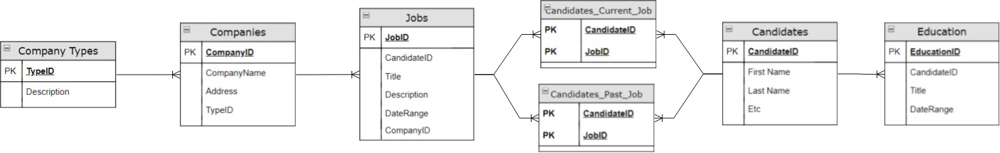

# hr data

## data manipulation

use the data model to generate a well documented and functional Postgresql code that answer the following exercises: *(tip: will be useful to create the data model tables on a db for this and next module exercise)*

**table creation and data load**

the `references/tables creation.sql` script contains the statements to create the tables and set the proper relationships between them. Additionally, in the `references/data load.sql` script the data is loaded into each of the previously created tables in the database.

1. which was the first job of every candidate? (in case of a tie choose a random job, it is not necessary to clean all the data.)

```sql
select
	cpj.candidate_id as "candidate id"
	,cpj.job_id as "job id"
	,j.title
	,j.date_range as "date"
	,substring(j.date_range from '\d{4}') as "past jobs year"
	,first_value(j.title) over(
		partition by cpj.candidate_id
		order by substring(j.date_range from '\d{4}')
	) as candidate_first_job
from candidate_past_jobs as cpj
join jobs as j
on cpj.job_id = j.job_id
```
2. calculate the total and running sum by years of experience, candidate and job, from the first one to the current one. (order by start_date from date_range, it is not necessary to clean all the data).

```sql
create temp table temp_running_sum as
select
	cast(substring(j.date_range from '\d{4}') as int) as past_job_year
	,sum(cast(substring(j.date_range from '\d{4}') as int)) over (
		order by cast(substring(j.date_range from '\d{4}') as int)
	) as running_sum
from jobs j

select * from temp_running_sum
```
## data modeling

1. using the following tables, ***re-draw*** a diagram of a dimensional data model based on these table. Identify facts, dimensions and relationships.

Entity Relationship Diagram (ERD) available at `references/nexton data modeling.jpg` and `references/nexton data modeling.drawio`




## dashboard and business intelligence

Use the previous data model to create an exploratory dashboard that helps the users to find the best talent to hire. Based on the given data, which would be your top 20 best candidtes to hire? Why? You can use any visualization tool of your choice and external data sources, but it needs to be shareable with a link. (Some examples are Tableau, Power BI, Google Data Studio).

extra points: add and external data source that connects through an API endpoint.

[link to dashboard report](https://lookerstudio.google.com/reporting/9cac680b-727f-4613-9cf1-aa2ff0c846bf/page/RTwcD)
